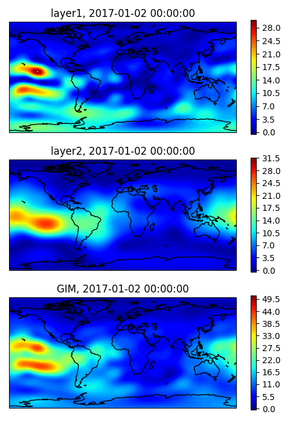

# MosGIM2

Global Ionopsheric Mapping with GNSS. 

## About

This code implements an original method for constructing Global Ionospheric Maps (GIM) of Total Electron Content (TEC) based on the analysis of solely phase measurements of GNSS signals at a pair of coherent frequencies, which does not require satellite/receiver DCBs estimations and thus makes it easier to combine different GNSS systems within single reconstruction algorithm.
This  method uses the representation of the ionosphere as two thin layers with the electron content in each of them given by a truncated expansion into a series of spherical harmonics in MLT system. The expansion coefficients are determined by least squares with inequality constrains representing the positivity of TEC, implemented by solving the corresponding linear complementarity problem (LCP). Algorithm description for single thin layer model is given in (cite if using code for your research): 

    Padokhin, A. M., E. S. Andreeva, M. O. Nazarenko, and S. A. Kalashnikova. "Phase-Difference Approach for GNSS Global Ionospheric Total Electron Content Mapping." Radiophysics and Quantum Electronics, 65(7): 481-495, 2023
    
Find full text paper [here](https://www.researchgate.net/profile/Artem-Padokhin/publication/370183741_Phase-Difference_Approach_for_GNSS_Global_Ionospheric_Total_Electron_Content_Mapping/links/64437a00d749e4340e2cb413/Phase-Difference-Approach-for-GNSS-Global-Ionospheric-Total-Electron-Content-Mapping.pdf)

## Prerequirements 

Code and launch were tested for Linux (Mint) and `python3.6.9`
Code uses `numpy`, `scipy`, `matplotlib`, `cartopy`, `h5py` and `lemkelcp` packages.
If you get TypeError: 'range' object does not support item assignment when calling `solve2.py`, adjust lines 8&9 `lemkelcp.py` in python dist-packages accordingly:
    self.wPos = list(range(n))
    self.zPos = list(range(n,2*n)) 

## Use test data

Test data are [here](https://simurg.space/gen_file?data=obs&date=2017-01-02)

## Run processing

Use consecutive `prepare2.py`,  `solve2.py` and `plot2.py` scripts to produce GIM animation:

    python prepare2.py --data_path /PATH/TO/DATA/ --res_file /PATH/TO/DATA/prepared_data.npz
    python solve2.py --in_file /PATH/TO/DATA/prepared_data.npz --out_file /PATH/TO/DATA/res.npz --nworkers 2
    python plot2.py --in_file /PATH/TO/DATA/res.npz --out_file /PATH/TO/DATA/animation.gif

* Put `2017-01-02.h5` from [data](https://simurg.space/gen_file?data=obs&date=2017-01-02) to `/PATH/TO/DATA/` 
* Adjust `nworkers` up to CPU cores you are able to use for computations.
* Additional parameters for `prepare2.py`: --ipph1, --ipph2 are heights of two shells of the model in meters, defaults are 300000. and 750000.
* Additional parameters for `solve2.py` are in the configuration block of the script
